# Document Intelligence Refinery: System Architecture

This document details the technical architecture, implementation logic, and data flow of the Document Intelligence Refinery (Phase 0 to Phase 5).

---

## 🗺️ Pipeline Architecture (End-to-End)

The refinery follows a tiered, agentic approach to document processing, prioritizing local extraction and fallback to VLMs only when confidence is low.

```mermaid
graph TD
    A[Raw PDF Ingest] --> B[Phase 1: Triage Agent]
    B -- DocumentProfile --> C{Strategy Router}
    
    C -- Strategy A --> D[FastText / pdfplumber]
    C -- Strategy B --> E[MinerU Layout/OCR]
    C -- Strategy C --> F[Vision / GPT-4o]
    
    D -- "Conf < 0.85" --> E
    E -- "Conf < 0.70" --> F
    
    D & E & F -- ExtractedDocument --> G[Phase 3 & 5: Chunking & Mastery]
    
    subgraph "Semantic Validation (5 Rules)"
        G --> G1[Table & List Integrity]
        G --> G2[Header Propagation]
        G --> G3[Spatial Provenance]
    end
    
    G1 & G2 & G3 -- Validated LDUs --> H((Indexing Layer))
    
    H --> I[SQLite FactTable]
    H --> J[ChromaDB VectorStore]
    H --> K[Hierarchical PageIndex Tree]
    
    L[User Query] --> M[Phase 4: Query Agent]
    M --> N{Query Classifier}
    
    N -- Quantitative --> I
    N -- Conceptual --> K
    K --> J
    
    I & J -- Raw Context --> O[Reasoner & Auditor]
    O -- "Provenance + Citations" --> P[Final Verified Answer]
```

---

## 🛠️ Implementation Details

### Phase 1: Triage Agent
- **Origin Detection**: Uses `char_density`, `ink_density`, and `whitespace_ratio` to classify documents as `DIGITAL_NATIVE` or `SCANNED`.
- **Strategy Selection**:
    - `DIGITAL_NATIVE` & `SIMPLE_LAYOUT` → Strategy A.
    - `SCANNED` or `MULTI_COLUMN` → Strategy B (MinerU).

### Phase 2: Extraction Engine & Strategy Escalation
We employ a 3-tier circuit-breaker strategy to balance cost and fidelity.

| Strategy | Engine | Trigger | Budget |
| :--- | :--- | :--- | :--- |
| **Strategy A** | FastText (pdfplumber) | Default for Digital Docs | $0.00 |
| **Strategy B** | **MinerU (magic-pdf)** | Scanned OR A < 0.85 confidence | $0.00 |
| **Strategy C** | Vision (GPT-4) | B < 0.70 OR B failure (OOM/Error) | $0.05 cap |

#### 💎 Confidence Scoring
**Formula**: `0.4 * completeness + 0.3 * layout + 0.2 * structural + 0.1 * ocr`
- **Signals**: `completeness_ratio`, `layout_consistency`, `structural_fidelity`, `ocr_quality`.

### Phase 3 & 5: Semantic Chunking & Mastery
- **LDU Formation**: Converts raw blocks into **Logical Document Units (LDUs)**.
- **5-Rule Validator**: Every emitted LDU must pass the `ChunkValidator` audit:
    1. **Table Integrity**: Rows never split from headers.
    2. **Header Propagation**: Section headers propagated for RAG context.
    3. **List Integrity**: Numbered/bulleted lists stay intact.
    4. **Context Preservation**: Split fragments carry `[Context: ...]` tags.
    5. **Spatial Provenance**: Strictly validated BBox and Page metadata.
- **Hierarchical PageIndex**: Built as a recursive tree using `parent_section` nesting.
    - Nodes store canonicalized `key_entities` and `data_types_present`.
    - Supports recursive `navigate()` and `search()` for high-precision retrieval.

### Phase 4: Query Routing & Provenance
The **Query Agent** uses a tiered routing approach:
1.  **QueryClassifier**: Determines if the query is **Quantitative** (SQL) or **Conceptual** (Vector).
2.  **Routing**:
    - **Quantitative** → Structured SQL lookup on `facts.db`.
    - **Conceptual** → Hierarchical PageIndex navigation + Restricted Vector Search.
3.  **Synthesis**: Strictly enforces that every answer contains a **Provenance Chain**.
4.  **Audit**: A second pass by the `ClaimAuditor` verifies the synthesis against the source.

---

## 🖼️ Handling Complex Elements

### 1. Table Extraction (MinerU + Mastery)
MinerU uses **YOLO** for detection. `ChunkValidator` then enforces that the extracted table structure adheres to markdown integrity rules, preventing row/header separation during chunking.

### 2. Image & Figure Handling
Figures are extracted with absolute bounding boxes. The `ChunkingEngine` performs contextual linking to create bidirectional relationships between text and images.

### 3. PageIndex Summarization
We use **Gemini-1.5-Flash** (primary) or **GPT-4o-mini** (fallback) to create hierarchical semantic maps. This avoids retrieval noise by "guiding" the search to the correct section first.
