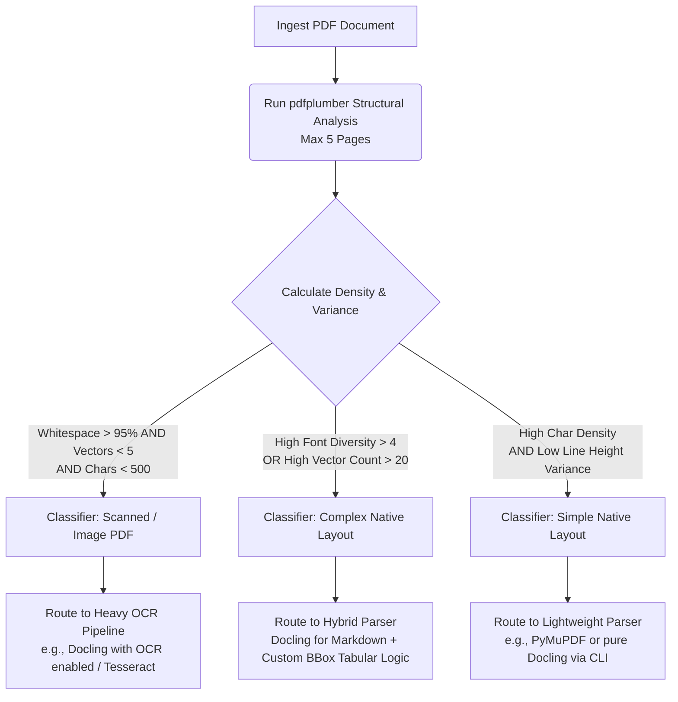
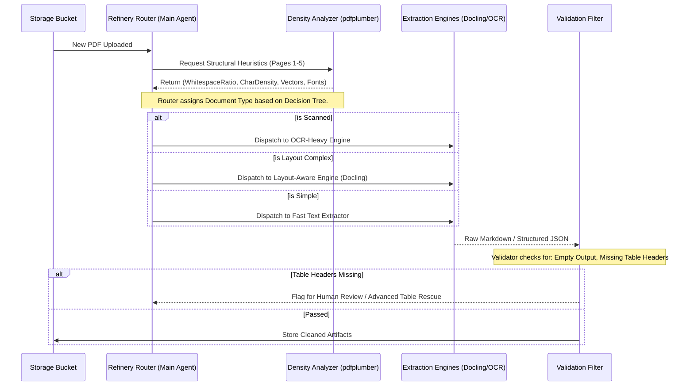
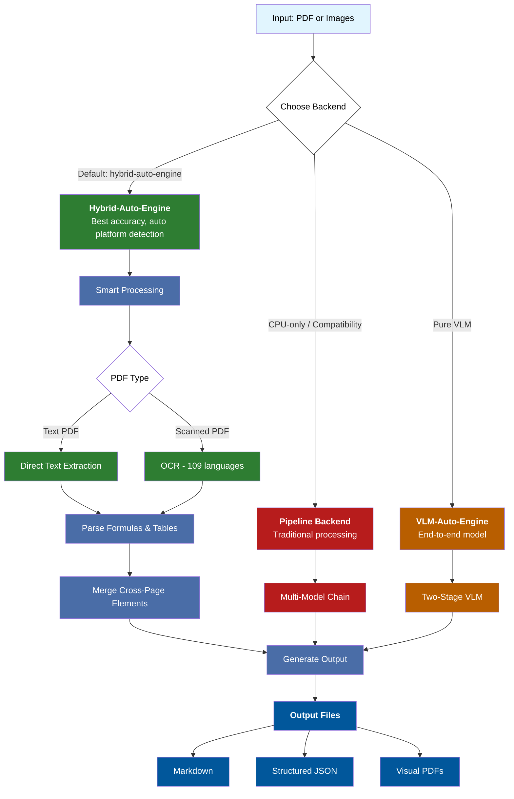

# Document Intelligence Extraction Notes

This document synthesizes findings from a structural and cross-tool comparative analysis of a sample of heavy Ethiopian regulatory and financial PDF documents. Tools evaluated were `pdfplumber` (for low-level spatial/structural layout heuristics) and `Docling` (for high-level layout extraction and markdown conversion).

## 1. Document Characteristics & Classification
The analyzed documents demonstrated significant layout complexity and structural variance.
- **Scanned vs Native**: `Audit Report - 2023.pdf` was strongly identified as a scanned document (`pdfplumber` detected only 116 readable characters vs Docling's OCR extraction of 539,681 characters).
- **Layout Complexity**: All other reports (`CBE ANNUAL REPORT`, `fta_performance`, `tax_expenditure`) were correctly flagged as having highly complex native layouts due to significant font diversity, variance in line heights, and high vector counts per page.

### Cross-Tool Comparative Metrics
| Document Name | pdfplumber (Chars) | Docling (Chars) | Extraction Ratio | Classification Hint | Potential Issues |
|---|---|---|---|---|---|
| `Audit Report - 2023.pdf` | 116 | 539,681 | 4652.42x | `likely_scanned` | Clean OCR Recovery |
| `tax_expenditure_ethiopia_2021_22.pdf` | 105,205 | 150,944 | 1.43x | `layout_complex` | Clean Extraction |
| `CBE ANNUAL REPORT 2023-24.pdf` | 319,492 | 520,263 | 1.63x | `layout_complex` | `potential_hallucination_or_over_segmentation` |
| `fta_performance_survey_final_report_2022.pdf` | 263,370 | 523,519 | 1.99x | `layout_complex` | `potential_hallucination_or_over_segmentation` |

## 2. Failure Modes Observed

A rigorous cross-tool comparison revealed the following major failure modes in the current extraction pipeline:

### A. Extreme Over-Segmentation / Potential Hallucination
In highly complex, natively digital PDFs with many tables and sidebars (e.g., `CBE ANNUAL REPORT`, `fta_performance_survey`), `Docling` returned between **1.6x and 2.0x** the character count extracted by `pdfplumber`. 
- **Cause**: Docling often aggressively flattens surrounding metadata, duplicate headers, or hallucinates tabular grid structures as text characters in complex financial reports.

### B. Header Ratio Imbalance in Tables
While Docling successfully detects tables, its ability to confidently detect the semantic *headers* of those tables drops significantly in complex documents:
- *Tax Expenditure Ethiopia*: 29 tables detected, 24 with inferred headers.
- *FTA Performance Survey*: 57 tables detected, only 25 with inferred headers.
- **Impact**: Without robust header row identification, semantic extraction (RAG) on financial tables degrades heavily.

## 3. Extraction Strategy Decision Tree

Based on these heuristics, a static "one size fits all" parser will fail. We need a dynamic routing strategy.

## 4. Proposed Parsing Pipeline Architecture

To execute on the Decision Tree above, the ingestion flow must incorporate an initial "Classification Node" that governs downstream processing.

## 5. MinerU Processing Pipeline

Below is a simplified flowchart of the MinerU pipeline for document processing:

## 6. Conclusion 

Based on the empirical evidence gathered from our internal extraction tests on complex regulatory documents:

1.  **pdfplumber excels at structural heuristics:** It is highly performant and accurate for gathering metadata bounding boxes, vector counts, and font diversity. It provides the essential, low-level metrics required to reliably classify a PDF's complexity *before* heavy processing begins.
2.  **Docling struggles as a generalized fallback for complex layouts:** While Docling produces visually clean Markdown, it is computationally expensive and prone to severe over-segmentation and hallucination on highly complex, natively digital PDFs (e.g., repeating grid lines or duplicate headers as text). Furthermore, its header-detection for embedded tables degrades significantly in non-standard layouts.
3.  **A dynamic pipeline is required:** A hybrid routing approach (as outlined in Sections 3 and 4) is the only viable path forward. By explicitly calculating document density and variance via pdfplumber first, the system can selectively dispatch documents to the appropriate extraction engine (e.g., lightweight parsing for clean text, or heavy OCR/VLM backends like MinerU for complex unstructured data), avoiding complete failure on edge cases while optimizing for cost and speed.
