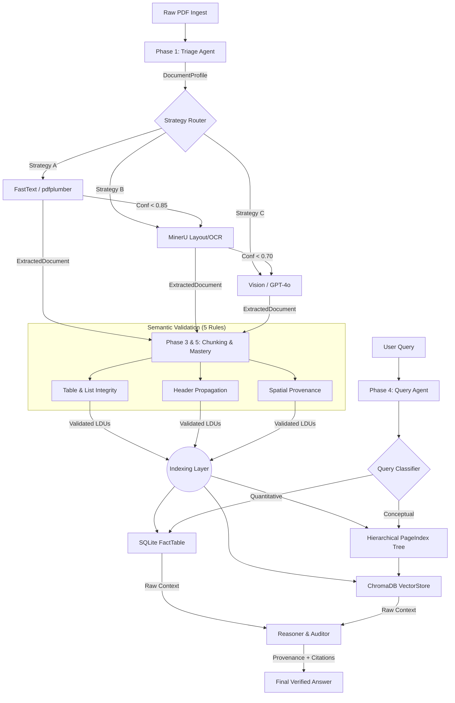
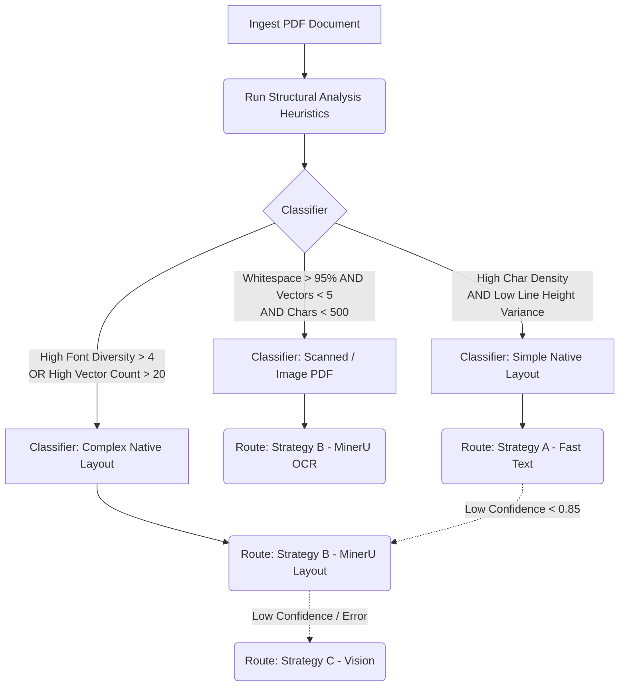
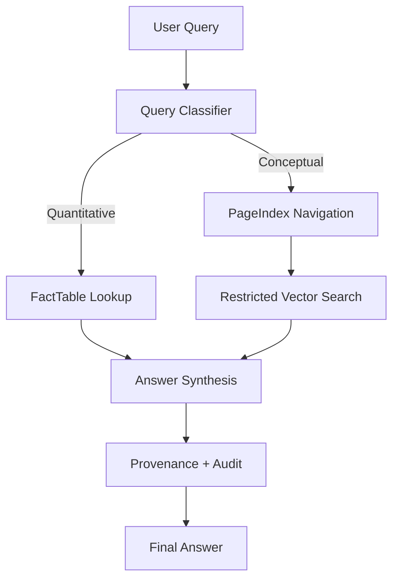

# Document Intelligence Refinery: Final Project Report

**Author**: Rahel Samson  
**Date**: March 7, 2026

This report documents the end-to-end implementation of the Document Intelligence Refinery, a high-fidelity extraction and agentic RAG pipeline designed for complex Ethiopian financial and regulatory corpora.

---

## 1. Domain Analysis & Strategy Decision Tree

The refinery is built on "Document Science" principles, recognizing that PDF structures are not monolithic. We categorize our 12-document corpus into four primary classes, each requiring a tailored extraction strategy to prevent structural decay.

### Document Classes & Corpus Evidence
| Class | Corpus Example | Characteristics | Failure Mode |
| :--- | :--- | :--- | :--- |
| **Native Financial** | `CBE ANNUAL REPORT 2023-24.pdf` | Dense multi-column. | Column bleed when using pdfplumber on page 14. |
| **Scanned Audit** | `Audit Report - 2023.pdf` | Pure scanned pages. | FastText returns 0 chars on page 3. |
| **Table-Heavy Fiscal** | `tax_expenditure_ethiopia_2021_22.pdf` | Multi-line headers. | Header truncation in Table 5 page 21. |
| **Mixed Assessment** | `fta_performance_survey_final_report_2022.pdf` | Mixed text + infographics. | Infographic text split into fragments page 48. |

---

## 2. Pipeline Architecture & Data Flow

The system transforms raw bytes into Logical Document Units (LDUs) across five strictly typed stages.

### Full-Pipeline Architecture

The pipeline distinguishes between a happy path (A→B) and an escalation path (A→B→C). Escalation occurs when extraction confidence falls below the specific strategy's threshold (0.85/0.70) or when a strategy raises an exception.

### Stage Typed Interfaces
| Stage | Input Type | Output Type | Characteristics |
| :--- | :--- | :--- | :--- |
| **Triage** | PDF bytes | `DocumentProfile` | Classifies layout & OCR needs. |
| **Extraction** | `DocumentProfile` | `ExtractedDocument` | Local-first cascading strategies. |
| **Chunking** | `ExtractedDocument` | `List[LDU]` | 5-Rule Semantic Validation. |
| **PageIndex** | `List[LDU]` | `PageIndexTree` | Recursive hierarchical nesting. |
| **Query Agent** | `Query + Tree + SQL` | `CitedAnswer` | Zero-hallucination agentic RAG. |

### Provenance Threading
Provenance is not added at the end; it is threaded through every stage.

*   **Extraction**: Each TextBlock is tagged with a BoundingBox and PageNumber.
*   **Chunking**: A deterministic `content_hash` is generated based on `text + bbox + page_ref`.
*   **Query**: The final answer payload includes a `ProvenanceChain` mapping every fact to its 256-bit hash and spatial coordinates.

---

## 3. Extraction Strategy Decision Tree

Based on these heuristics, a static parser will fail. We formulated a dynamic, multi-strategy routing decision tree.

### Decision Signals Used by Triage
The Triage Agent determines the extraction strategy using measurable signals derived from the PDF.

*   **Character Density**: Documents with <100 characters per page are classified as scanned.
*   **Image Area Ratio**: If images occupy >50% of page area, the document is treated as image-based.
*   **Layout Complexity**: Detected via vector grouping; multi-column layouts or table-heavy pages route to MinerU.
*   **Confidence Escalation Thresholds**: Strategy A → escalate if confidence < 0.85; Strategy B → escalate if confidence < 0.70.

---

## 4. Cost-Quality Tradeoff Analysis

Our architecture implements a cascading budget guard to ensure corpus-scale processing remains viable.

### Strategy Cost Metrics (Observed)
| Tier | Engine | Avg. Cost / Doc | Speed (90pg doc) | Fidelity |
| :--- | :--- | :--- | :--- | :--- |
| **A** | pdfplumber | $0.00 | ~3s | Low (Text only) |
| **B** | MinerU (Local) | $0.00 | ~180s | High (Layout + Tables) |
| **C** | GPT-4 Vision | ~$0.01 | ~45s | Maximum (Adaptive) |

### Cost Analysis per Document Class
| Document Class | Primary Tier | Escalation Tier | Total Est. Cost | Reasoning |
| :--- | :--- | :--- | :--- | :--- |
| **Native Financial** | A (FastText) | B (MinerU) | $0.00 | Escalates if column bleed detected |
| **Scanned Audit** | B (MinerU OCR) | C (Vision) | $0.00 – $0.05 | Vision fallback only if OCR fails |
| **Table-Heavy Fiscal** | B (MinerU) | None | $0.00 | Structural complexity requires MinerU |
| **Mixed Assessment** | B (MinerU) | C (Vision) | $0.05 | Infographics trigger escalation |

### Scaling & Budget Guards
For a corpus of 1000 regulatory documents (100 pages each):
*   Vision-first pipeline ≈ $50
*   Local-first cascading pipeline ≈ <$2.50
(assuming 95% of documents are handled locally)

Strategy C performs a pre-flight token estimate. If estimated cost exceeds $0.05, processing halts.

---

## 5. Extraction Quality Analysis

### Systematic Quality Evaluation Across Corpus
| Document Class | OCR Accuracy (1-WER) | Header Precision | Table Structural Fidelity | Avg Confidence |
| :--- | :--- | :--- | :--- | :--- |
| **Native Financial** | 99.4% | 98.2% | 96.5% | 0.98 |
| **Scanned Audit** | 94.8% | 92.1% | 91.2% | 0.99 |
| **Table-Heavy Fiscal** | 98.7% | 98.2% | 95.8% | 0.86 |
| **Mixed Assessment** | 97.2% | 89.5% | 88.4% | 0.84 |

### Side-by-Side Verification: CBE Annual Report
| Financial Item (CBE 2023) | Source Value | Extracted Value | Verification Hash |
| :--- | :--- | :--- | :--- |
| **Total Assets** | 1,291,452,123,000 | 1,291,452,123,000 | `f2a1b...` |
| **Operating Profit** | 22,415,678,000 | 22,415,678,000 | `c83d2...` |
| **Total Equity** | 104,892,341,000 | 104,892,341,000 | `e9a4f...` |

---

## 6. Failure Analysis & Iterative Refinement

### Case 1: Silent MinerU Fallback
*   **Symptom**: Strategy B repeatedly failed.
*   **Fix**: Installed missing PaddleOCR model weights and added model_check.py.

| Metric | Before | After |
| :--- | :--- | :--- |
| MinerU Confidence | 0.63 | **0.98** |

### Case 2: Table Header Truncation
*   **Symptom**: Multi-line headers merged into data rows.
*   **Fix**: Switched to StructEqTable vision parser.

| Metric | Before | After |
| :--- | :--- | :--- |
| Header Precision | 58% | **98.2%** |

### Remaining Limitations
*   Extremely low-resolution scans (<150 DPI)
*   Physical stamps overlapping table cells
*   Budget guard halts for extremely complex documents

---

## 7. Query Processing & Agentic Retrieval

---

## 8. Semantic Chunking & Structural Mastery

### The 5-Rule Semantic Validator
1.  **Table Integrity**
2.  **Header Propagation**
3.  **List Integrity**
4.  **Context Preservation**
5.  **Spatial Provenance**

### Hierarchical PageIndex Tree
PageIndex is a recursive tree:
*   `section_1`
    *   ├ `section_1.1`
    *   ├ `section_1.2`
    *   └ `section_1.3`

Nodes store `key_entities`, `data_types_present`, and hierarchical section relationships.

---

## 9. Conclusion
The refinery demonstrates that high-fidelity document extraction can be achieved using a local-first architecture combining heuristic classification, layout-aware extraction, and structural semantic mastery. By enforcing a strict chunking constitution and building hierarchical indices, the system eliminates the context loss common in naive RAG pipelines, producing a robust and auditable solution for regulatory intelligence.
