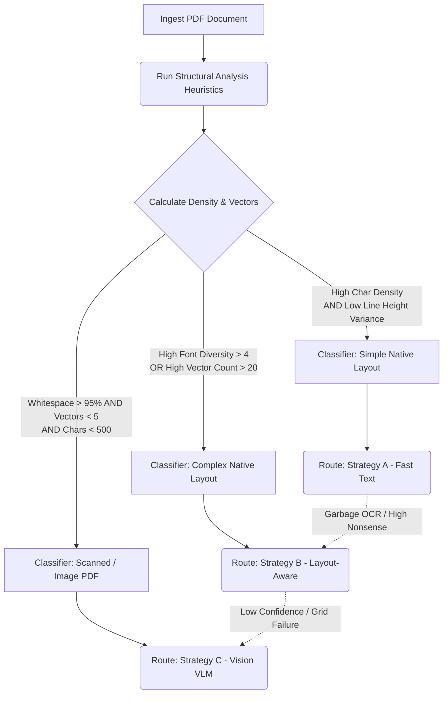
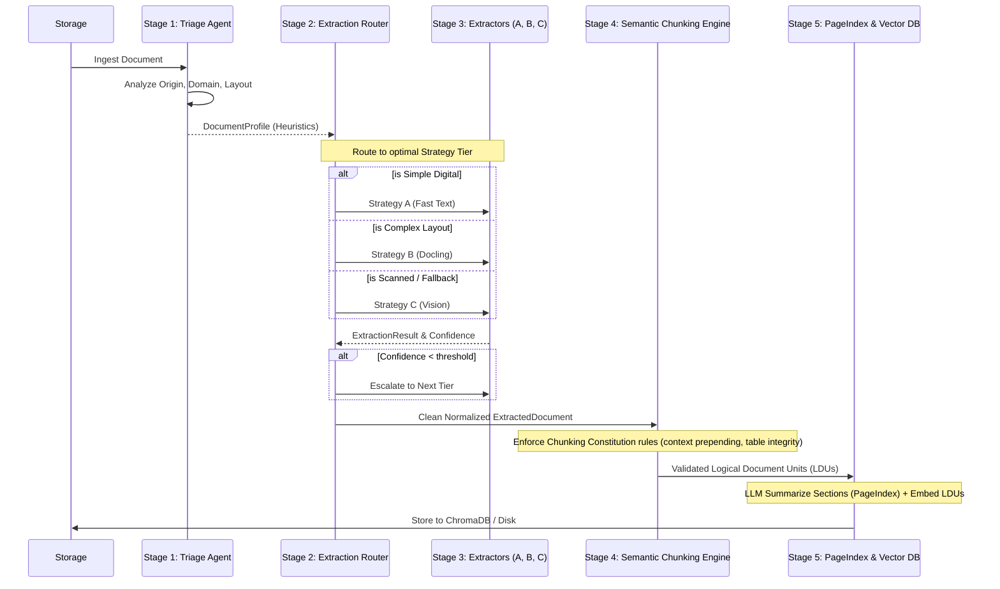

# Document Intelligence Refinery - Final Report

This report consolidates Phase 0 deliverables (Domain Notes), extraction strategies, architecture definitions, and cost analyses for the Document Intelligence Refinery pipeline.

---

## 1. Domain Notes (Phase 0 Deliverable)

An empirical structural analysis of Ethiopian regulatory and financial PDF documents was conducted to determine optimal extraction pathways.

### Document Characteristics & Classification
The analyzed documents demonstrated significant layout complexity and structural variance:
- **Scanned vs Native**: Certain reports (e.g., `Audit Report - 2023.pdf`) are heavily scanned, yielding minimal raw characters via standard parsing (116 chars) compared to full OCR recovery (539k chars).
- **Layout Complexity**: Documents like `CBE ANNUAL REPORT` and `tax_expenditure` possess highly complex native layouts, featuring intense font diversity, variance in line heights, and extensive vector graphics.

### Structural Signals Used by the Triage Agent
The system uses several metrics to classify documents accurately prior to extraction:

- **Character Density** (`chars / page_area`): Helps determine if text is sparse or dense.
- **Whitespace Ratio**: Percentage of blank page area.
- **Vector Density**: Number of graphical vector objects detected.
- **Font Diversity**: Count of unique font families detected.

These signals determine the `origin_type`, `layout_complexity`, and `domain_hint`. For example:
High whitespace (>95%) combined with very low character density indicates scanned PDFs. High vector density and high font diversity typically indicate complex financial reports with tables and diagrams.

---

## 2. Failure Modes Observed Across Document Types

Rigorous cross-tool comparisons (`pdfplumber` vs `Docling`) revealed primary extraction failure modes:

### A. Extreme Over-Segmentation & Hallucination
In highly complex, natively digital PDFs with dense tables and sidebars, layout-aware models (like Docling) occasionally returned **1.6x to 2.0x** the character count extracted by pure text parsers.
- **Cause**: Heavy extractors often flatten surrounding metadata, duplicate headers, or hallucinate tabular grid lines as actual text characters when processing non-standard financial reports.

### B. Header Ratio Imbalance in Tables
While layout-aware models successfully detect tables, their ability to confidently detect the semantic *headers* drops significantly in complex documents:
- *Tax Expenditure Ethiopia*: 29 tables detected, 24 with inferred headers.
- *FTA Performance Survey*: 57 tables detected, only 25 with inferred headers.
- **Impact**: Without robust header row identification, downstream semantic extraction (RAG) degrades.

### C. The "Hidden OCR" Layer
Some digital "native" documents carry hidden, corrupted OCR text layers overlaid on scans. If ingested blindly, the parser returns garbage characters ("nonsense ratio"), destroying the index. 

---

## 3. Extraction Strategy Decision Tree

Based on these heuristics, a static parser will fail. We formulated a dynamic, multi-strategy routing decision tree:

### Strategy Comparison Table

| Strategy | Tool | Trigger | Cost |
| :--- | :--- | :--- | :--- |
| Strategy A | pdfplumber | simple native PDFs | $0 |
| Strategy B | Docling | complex layout / tables | $0 |
| Strategy C | GPT-4o-mini | scanned or fallback | ~$0.01 |

### Extraction Confidence Scoring

Confidence scoring evaluates extraction quality for Strategy A and Strategy B. 

FastTextExtractor scores documents based on multiple signals:
- `character_count`
- `character_density`
- `image_to_page_area_ratio`
- `font_metadata_presence`

Additionally, a strict scanning heuristic is applied:
If `image_ratio > 0.5` AND `character_count < 50` → confidence is forced to `0.0`.
Low confidence immediately triggers router escalation.

### Confidence-Gated Escalation Guard

The `ExtractionRouter` enforces a tiered extraction pipeline relying on specific thresholds:
- Strategy A threshold: `0.85`
- Strategy B threshold: `0.70`
- Strategy C threshold: `0.60`

The escalation sequence proceeds as follows:
`FastTextExtractor`
↓ if confidence < threshold
`LayoutExtractor` (Docling)
↓ if confidence < threshold
`VisionExtractor` (VLM)

This prevents garbage extraction, hallucinated tables, and broken OCR text from corrupting the index.

---

## 4. Full 5-Stage Document Intelligence Pipeline

To execute the intelligent routing and chunking, the complete 5-Stage Pipeline architecture is defined below:

### Extraction Observability Ledger

All routing and extraction actions are logged in `.refinery/extraction_ledger.jsonl`.
This ledger records the following fields for every extraction:
- `strategy_used`
- `confidence_score`
- `processing_time`
- `tokens_in`
- `tokens_out`
- `page_count`
- `cost_estimate`
- `error_category`

This atomic ledger provides crucial benefits including auditability, cost monitoring, failure analysis, and simple debugging of extraction quality over time.

---

## 5. Cost Analysis & Estimated Cost Per Document Tier

The extraction engine operates on a cascading cost-efficiency model, ensuring expensive operations are only used when absolutely necessary.

### **Strategy A: Fast Text (pdfplumber)**
- **Target**: Clean, simple, digital-native text.
- **Cost Aspect**: Pure standard local CPU compute. Extremely fast, minimal RAM overhead.
- **Estimated API / Usage Cost**: **$0.00** per document.

### **Strategy B: Layout-Aware (Docling)**
- **Target**: Complex native layouts, heavy multi-column text, multi-page spanning tables.
- **Cost Aspect**: High CPU/GPU utilization and high RAM footprint. Can take several minutes per 100-page document locally. Infrastructure overhead is required to scale, but no per-token API fees are triggered.
- **Estimated API / Usage Cost**: **$0.00** per document (excluding local cloud compute runtime).

### **Strategy C: Vision-Augmented (VLM via OpenRouter)**
- **Target**: Heavily scanned documents, corrupted PDFs, unreadable images, or structural router fallbacks.
- **Cost Aspect**: High external API dependency. Dispatches high-res base64 images to `gpt-4o-mini` (or equivalent).
- **Hard Cap Budget Guard**: Enforced at `GLOBAL_DOCUMENT_BUDGET_USD` = **$0.05** per document.
- **Budget Guard Algorithm**: Before dispatching a Vision batch, the system estimates the exact cost:
  `estimated_cost = (tokens_in / 1M * price_input) + (tokens_out / 1M * price_output)`
  If `estimated_cost` exceeds `GLOBAL_DOCUMENT_BUDGET_USD`, the VisionExtractor stops processing, returns a `PartialExtractionResult`, and logs a `BUDGET_CAP_HIT`.
- **Estimated Average Cost**:
  - Assuming standard $0.15 / 1M Input Tokens and $0.60 / 1M Output Tokens.
  - A standard 15-page scanned document yields ~30,000 input tokens and ~8,000 output tokens.
  - Calculation: `(30,000/1M * $0.15) + (8,000/1M * $0.60)` = `$0.0045 + $0.0048`
  - **Estimated Cost**: **~$0.01** per average document.

---

## 6. Preparation for Semantic Retrieval

Extracted content from the pipeline is normalized into strict `ExtractedDocument` schemas. 
These objects will later be converted into Logical Document Units (LDUs) during Phase 3 semantic chunking, paving the way for seamless ingestion into the vector store and optimal hierarchical Retrieval-Augmented Generation (RAG).
